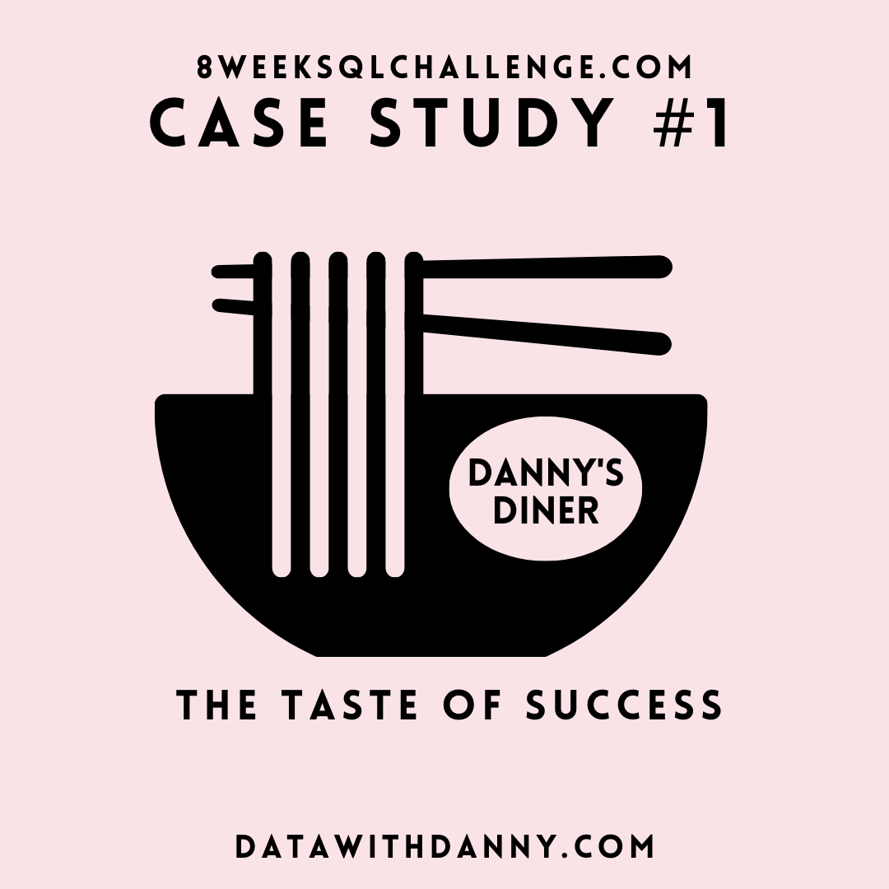
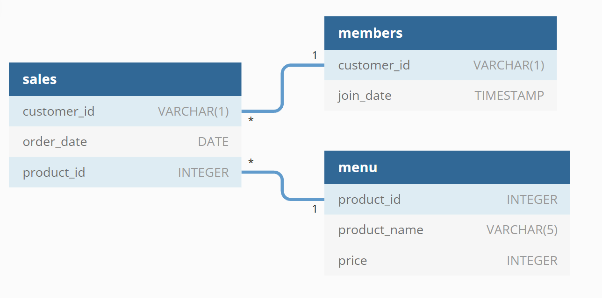

> This case study can be found in the  [8weeksqlchallenge.com](https://8weeksqlchallenge.com/case-study-1/).




# Table of contents
- [📚About](#About)
- [📜Problem Statement](#Problem-Statement)
- [📌❓Case Study Questions](#Case-Study-Questions)
- [🕵️‍♀️Understand and Explore Data](#Understand-and-Explore-Data)
- [⚒Solution](#Solution)

<h1><b>📚About</b></h1>

Danny seriously loves Japanese food so in the beginning of 2021, he decides to embark upon a risky venture and opens up a cute little restaurant that sells his 3 favourite foods: sushi, curry and ramen.

Danny’s Diner is in need of your assistance to help the restaurant stay afloat - the restaurant has captured some very basic data from their few months of operation but have no idea how to use their data to help them run the business.

<h1><b>📜Problem Statement</b></h1>

Danny wants to use the data to answer a few simple questions about his customers, especially about their visiting patterns, how much money they’ve spent and also which menu items are their favourite. Having this deeper connection with his customers will help him deliver a better and more personalised experience for his loyal customers.

He plans on using these insights to help him decide whether he should expand the existing customer loyalty program - additionally he needs help to generate some basic datasets so his team can easily inspect the data without needing to use SQL.

<h1><b>📌❓Case Study Questions</b></h1>

These are the questions that were provided:

1. What is the total amount each customer spent at the restaurant?
2. How many days has each customer visited the restaurant?
3. What was the first item from the menu purchased by each customer?
4. What is the most purchased item on the menu and how many times was it purchased by all customers?
5. Which item was the most popular for each customer?
6. Which item was purchased first by the customer after they became a member?
7. Which item was purchased just before the customer became a member?
8. What is the total items and amount spent for each member before they became a member?
9. If each $1 spent equates to 10 points and sushi has a 2x points multiplier - how many points would each customer have?
10. In the first week after a customer joins the program (including their join date) they earn 2x points on all items, not just sushi - how many points do customer A and B have at the end of January?

<h1><b>🕵️‍Understand and Explore Data</b></h1>

<details>
<summary>
View 
</summary>
Danny provided a sample of his overall customer data due to privacy issues. He also provided an entity-relationship diagram (ERD).




There are 3 tables in the ERD:

- ``sales``
- ``menu``
-  ``members``

## Table#1 - sales

**1.Get a preview of the ``sales`` table.**
```sql
SELECT
  	* 
FROM dannys_diner.sales
LIMIT 5;
```
| customer_id | order_date               | product_id |
| ----------- | ------------------------ | ---------- |
| A           | 2021-01-01T00:00:00.000Z | 1          |
| A           | 2021-01-01T00:00:00.000Z | 2          |
| A           | 2021-01-07T00:00:00.000Z | 2          |
| A           | 2021-01-10T00:00:00.000Z | 3          |
| A           | 2021-01-11T00:00:00.000Z | 3          |

**Observation**
This table contains  ``customer_id`` and product they purchased on a given  ``order_date``.

``COUNT`` number of records in the sale table

```sql
SELECT 
  COUNT(*) AS count_sales
FROM dannys_diner.sales;
```

| count_sales |
|-------------|
| 15          |


**Observation**
There were a total of 15 sales in the ``sales`` table.

**2. Check Datatypes, default values, and if the columns can contains null records**
 This table was created with the script and we have access to ERD , but it is good practice to check the datatypes before we move ahead which questions
 ```sql   
    SELECT
      table_name,
      column_name,
      data_type,
     column_default,
     is_nullable
    FROM information_schema.columns
    WHERE table_name = 'sales';
```

| table_name | column_name | data_type         | column_default | is_nullable |
| ---------- | ----------- | ----------------- | -------------- | ----------- |
| sales      | order_date  | date              |  null          | YES         |
| sales      | product_id  | integer           |  null          | YES         |
| sales      | customer_id | character varying |  null          | YES         |

**Observation**
Columns can contain null values

**3. Check for any null values in columns**
```sql
 SELECT *  
 FROM dannys_diner.sales
 WHERE customer_id IS NULL or
 order_date IS NULL or product_id IS NULL
 ```
**Observation**
No null values were found

## Table#2 - menu

**1.Get a preview of the ``menu`` table.**
```sql
SELECT *
FROM dannys_diner.menu
LIMIT 5;
```
| product_id | product_name | price |
|------------|--------------|-------|
| 1          | sushi        | 10    |
| 2          | curry        | 15    |
| 3          | ramen        | 12    |

**Observation**
This table contains all the dishes with their prices, that are sold in the diner. 
The ``menu`` table is linked to the previous ``sales`` table via the ``product_id``.

**2. Check Datatypes, default values, and if the columns can contains null records**

```sql
   SELECT
      table_name,
      column_name,
      data_type,
     column_default,
     is_nullable
    FROM information_schema.columns
    WHERE table_name = 'menu';
```
| table_name | column_name  | data_type         | column_default | is_nullable |
| ---------- | ------------ | ----------------- | -------------- | ----------- |
| menu       | product_id   | integer           |   null         | YES         |
| menu       | price        | integer           |   null         | YES         |
| menu       | product_name | character varying |   null         | YES         |

**Observation**
Columns can contain null values

**3. Check for any null values in columns**
```sql
    SELECT
    FROM  dannys_diner.menu
    WHERE product_id IS NULL OR
    price IS NULL OR
    product_name IS NULL ;
 ```
**Observation**
No null values were found


## Table #3 - members 
**1.Get a preview of the ``menu`` table.**
```sql
SELECT * 
FROM dannys_diner.members 
LIMIT 5;
```
| customer_id | join_date  |
|-------------|------------|
| A           | 2021-01-07 |
| B           | 2021-01-09 |

**Observation**
This table contains the ``customer_id`` and date when the joined reward program of the restaurant.
 </details>
<h1><b>🛠Solution</b></h1>

**1. What is the total amount each customer spent at the restaurant?**

  Price is in menu table so joining sales with menu.Since we need amount for  `each customer` we group by customer_id 
  and we need total so using aggregate function `SUM`.

 
```sql
SELECT 
	sales.customer_id,
  SUM(menu.price) AS total_spent
FROM dannys_diner.sales
JOIN dannys_diner.menu
	ON sales.product_id = menu.product_id
GROUP BY customer_id
ORDER BY customer_id;
```
Output:

| customer_id  | total_spent  |
|--------------|--------------|
| A            | 76           |
| B            | 74           |
| C            | 36           |


**Insights:**

Customer `A` spent 76$ in total, Customer `B` spent 74$ in total and Customer `C` spent only 36$ in total.

**2. How many days has each customer visited the restaurant?**
 We need  `each customer`, so we group by customer and we need count  so using aggregate function `COUNT`

```sql
SELECT
  customer_id,
  COUNT (DISTINCT order_date) AS visited_days
FROM dannys_diner.sales
GROUP BY customer_id;
```
Output:

| customer_id  | visited_days  |
|--------------|-------------- |
| A            | 4             |
| B            | 6             |
| C            | 2             |


**Insights:**

Customer `B` visited the store 6 times, customer `A` 4 times and customer `C` only 2 times.

**3. What was the first item from the menu purchased by each customer?**

In this question , how do we know which item they purchased, for first time there is not time field.
For eg customer A ordered Sushi and Curry , so should we assume since Sushi was first inserted therefore that was first item. 
Product name is in menu table so joining sales with menu.
Using Window function `ROW_NUMBER`  that assigns a sequential integer to each row in a result set and partitioning by customer id. 
and then filtering the result set where first purchase is 1


```sql
WITH cte_order AS (
  SELECT
    sales.customer_id,
    menu.product_name,
    ROW_NUMBER() OVER(
     PARTITION BY sales.customer_id
      ORDER BY 
        sales.order_date,  
        sales.product_id
    ) AS first_purchase
    FROM dannys_diner.sales
    JOIN dannys_diner.menu
    ON sales.product_id = menu.product_id
)
SELECT * FROM cte_order
WHERE first_purchase = 1;
```
Output:

| customer_id  | product_name  | first_purchase|
|--------------|-------------- |---------------|
| A            | sushi         | 1             |
| B            | curry         | 1             |
| C            | ramen         | 1             |

**Insights:**

Customer `A` had sushi for the first time, customer `B` had curry and customer `C` had ramen.

**4. What is the most purchased item on the menu and how many times was it purchased by all customers?**

```sql
SELECT
  menu.product_name,
  COUNT(sales.product_id) AS order_count
FROM dannys_diner.sales
INNER JOIN dannys_diner.menu
  ON sales.product_id = menu.product_id
GROUP BY
  menu.product_name
ORDER BY order_count DESC
LIMIT 1;
```
Output:
| product_id  | product_name  | order_count  |
|-------------|---------------|--------------|
| 3           | ramen         | 8            |


 **Insights:**

The most purchased product was `ramen` as it was purchased 8 times.

**5. Which item was the most popular for each customer?**

```sql
WITH cte_order_count AS (
  SELECT
    sales.customer_id,
    menu.product_name,
    COUNT(*) as order_count
  FROM dannys_diner.sales
  JOIN dannys_diner.menu
    ON sales.product_id = menu.product_id
  GROUP BY 
    customer_id,
    product_name
  ORDER BY
    customer_id,
    order_count DESC
),
cte_popular_rank AS (
  SELECT 
    *,
    RANK() OVER(PARTITION BY customer_id ORDER BY order_count DESC) AS rank
  FROM cte_order_count
)
SELECT * FROM cte_popular_rank
WHERE rank = 1;
```
Output:

| customer_id  | product_name  | order_count  | rank  |
|--------------|---------------|--------------|-------|
| A            | ramen         | 3            | 1     |
| B            | ramen         | 2            | 1     |
| B            | curry         | 2            | 1     |
| B            | sushi         | 2            | 1     |
| C            | ramen         | 3            | 1     |


**Insights:**

The favorite dish of customer A & customer C is ramen while the favorite dishes for customer B are curry, ramen and sushi.

**6. Which item was purchased first by the customer after they became a member?**

 ```sql
    WITH
        cte_first_member_order
        AS
        (
        SELECT customer_id, product_name, order_date, RANK() OVER(
        PARTITION BY customer_id
        ORDER BY order_date) as purchase
            FROM dannys_diner.sales AS s
                INNER JOIN dannys_diner.menu USING(product_id)
                LEFT JOIN dannys_diner.members AS mem  USING(customer_id) 
            WHERE s.order_date >= join_date
            ORDER BY order_date
        )
    SELECT customer_id,product_name,order_date
    FROM cte_first_member_order
    WHERE purchase=1;
```
Output:

| customer_id | product_name | order_date               |
| ----------- | ------------ | ------------------------ |
| A           | curry        | 2021-01-07T00:00:00.000Z |
| B           | sushi        | 2021-01-11T00:00:00.000Z |

**Insights:**

Customer A bought curry and customer B had sushi after being a member.

**7. Which item was purchased just before the customer became a member?**

```sql
WITH
    cte_last_order_before_member
    AS
   (
        SELECT customer_id, product_name, order_date, RANK() OVER(
    PARTITION BY customer_id
    ORDER BY order_date desc) as purchase
        FROM dannys_diner.sales AS s
            INNER JOIN dannys_diner.menu USING(product_id)
            LEFT JOIN dannys_diner.members AS mem  USING(customer_id) 
        WHERE s.order_date < join_date
        ORDER BY order_date desc
    )
SELECT customer_id,product_name,order_date
FROM cte_last_order_before_member
WHERE purchase=1;
```
Output:

| customer_id  | product_name  | order_date                |
|--------------|---------------|---------------------------|
| A            | sushi         | 2021-01-01T00:00:00.000Z  |
| A            | curry         | 2021-01-01T00:00:00.000Z  |
| B            | sushi         | 2021-01-04T00:00:00.000Z  |


**Insights:**

Customer A bought sushi and curry while customer B had curry before being a member.

**8. What is the total items and amount spent for each member before they became a member?**


```sql
WITH
    cte_spent_before_mem
    AS
   (
        SELECT customer_id, SUM(price) AS total_spent,count(s.product_id) as total_item
        FROM dannys_diner.sales AS s
            INNER JOIN dannys_diner.menu USING(product_id)
            INNER JOIN dannys_diner.members AS mem  USING(customer_id) 
        WHERE s.order_date < join_date
        GROUP BY customer_id
    )
SELECT *
FROM cte_spent_before_mem;
```
Output:

| customer_id  | total_spent  | total_items  |
|--------------|--------------|--------------|
| A            | 25           | 2            |
| B            | 40           | 3            |


**Insights:**
Before becoming a member customer A spent 25$ on 2  products while customer B spent 40$ on 3 products.

**9.  If each $1 spent equates to 10 points and sushi has a 2x points multiplier - how many points would each customer have?**

Case expression are really helpful in such scenarois and behave similar to if else statements So if product is sushi then we multiply price by 20 
or else multiply price by 10

```sql
SELECT customer_id, 
       SUM(CASE WHEN product_name = 'sushi' THEN  (price * 20)
            ELSE (price * 10) END ) AS total_points,
       COUNT(s.product_id) as total_item
FROM dannys_diner.sales AS s
INNER JOIN dannys_diner.menu USING(product_id)
GROUP BY customer_id;
```
Output:

| customer_id | total_points | total_item |
| ----------- | ------------ | ---------- |
| A           | 860          | 6          |
| B           | 940          | 6          |
| C           | 360          | 3          |

**Insights:**

Customer A has 860 points, customer B has 940 points and customer C has 360 points.

**10. In the first week after a customer joins the program (including their join date) they earn 2x points on all items, not just sushi - how many points do customer A and B have at the end of January?**

We need a range of date  from the date customer became a member till first 6 days( 1 week) , so we use CASE with 'and` condition.

```sql
SELECT dannys_diner.sales.customer_id , 
SUM(CASE WHEN order_date >= join_date AND order_date <= join_date + 6  THEN price * 20  
         WHEN product_name = 'sushi' THEN price * 20  
  	ELSE  price * 10  
    END ) as points 
FROM dannys_diner.sales 
LEFT JOIN dannys_diner.menu USING (product_id) 
LEFT JOIN dannys_diner.members USING (customer_id) 
WHERE (customer_id = 'A' OR customer_id = 'B') 
AND order_date < '2021-01-31' 
GROUP BY customer_id;
```
Output:

| customer_id | points       |
|-------------|--------------|
| A           | 1370         |
| B           | 820          |

**Insights:**

At the end of january, customer A would have 1370 points while customer B would have 820 points.


**Currently not attempting the bonus question , but will revisit it later**

