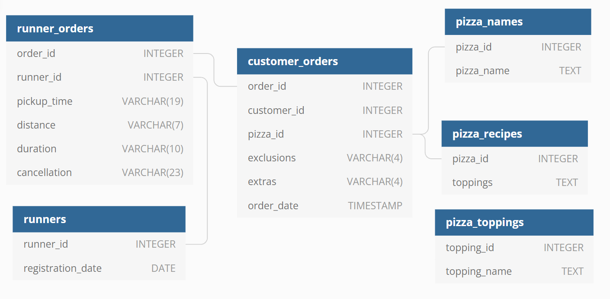

# 🍕 Case Study #2 - Pizza Runner


# Table of contents
- [⚒Solution](#-Solution)
- [📚About](#About)
- [📜Problem Statement](#Problem-Statement)
- [📌❓Case Study Questions](#Case-Study-Questions)
- [🕵️‍♀️Understand and Explore Data](#Understand-and-Explore-Data)
- [👩‍💻Data Preprocessing](#Data-Preprocessing)
- [⚒Solution](#Solution)

<h1><b>📚About</b></h1>
Danny was scrolling through his Instagram feed when something really caught his eye - “80s Retro Styling and Pizza Is The Future!”

Danny was sold on the idea, but he knew that pizza alone was not going to help him get seed funding to expand his new Pizza Empire - so he had one more genius idea to combine with it - he was going to Uberize it - and so Pizza Runner was launched!

Danny started by recruiting “runners” to deliver fresh pizza from Pizza Runner Headquarters (otherwise known as Danny’s house) and also maxed out his credit card to pay freelance developers to build a mobile app to accept orders from customers.


<h1><b>📜Problem Statement</b></h1>
Danny wants to get insights about pizza metrics , pattern in orders, runner and customer experience, effect of including or excluding ingredient from receipe,price and rating for pizza. This insights will help him  better direct his runners , increase his profits,Optimize Pizza Runner’s operations.

<h1><b>📌❓Case Study Questions</b></h1>

## A. Pizza Metrics
- How many pizzas were ordered?
- How many unique customer orders were made?
- How many successful orders were delivered by each runner?
- How many of each type of pizza was delivered?
- How many Vegetarian and Meatlovers were ordered by each customer?
- What was the maximum number of pizzas delivered in a single order?
- For each customer, how many delivered pizzas had at least 1 change and how many had no changes?
- How many pizzas were delivered that had both exclusions and extras?
- What was the total volume of pizzas ordered for each hour of the day?
- What was the volume of orders for each day of the week?

## B. Runner and Customer Experience
- How many runners signed up for each 1 week period? (i.e. week starts 2021-01-01)
- What was the average time in minutes it took for each runner to arrive at the Pizza Runner HQ to pickup the order?
- Is there any relationship between the number of pizzas and how long the order takes to prepare?
- What was the average distance travelled for each customer?
- What was the difference between the longest and shortest delivery times for all orders?
- What was the average speed for each runner for each delivery and do you notice any trend for these values?
- What is the successful delivery percentage for each runner?

## C. Ingredient Optimisation
- What are the standard ingredients for each pizza?
- What was the most commonly added extra?
- What was the most common exclusion?
- Generate an order item for each record in the customers_orders table in the format of one of the following:
  1.Meat Lovers
  2.Meat Lovers - Exclude Beef
  3.Meat Lovers - Extra Bacon
  4.Meat Lovers - Exclude Cheese, Bacon - Extra Mushroom, Peppers
- Generate an alphabetically ordered comma separated ingredient list for each pizza order from the customer_orders table and add a 2x in front of any relevant ingredients
   For example: "Meat Lovers: 2xBacon, Beef, ... , Salami"
- What is the total quantity of each ingredient used in all delivered pizzas sorted by most frequent first?

## D. Pricing and Ratings
- If a Meat Lovers pizza costs $12 and Vegetarian costs $10 and there were no charges for changes - how much money has Pizza Runner made so far if there are no delivery fees?
- What if there was an additional $1 charge for any pizza extras?Add cheese is $1 extra
- The Pizza Runner team now wants to add an additional ratings system that allows customers to rate their runner, how would you design an additional table for this new dataset  generate a schema for this new table and insert your own data for ratings for each successful customer order between 1 to 5.
- Using your newly generated table - can you join all of the information together to form a table which has the following information for successful deliveries?
 1.customer_id
 2.order_id
 3.runner_id
 4.rating
 5.order_time
 6.pickup_time
 7.Time between order and pickup
 8.Delivery duration
 9.Average speed
10.Total number of pizzas
- If a Meat Lovers pizza was $12 and Vegetarian $10 fixed prices with no cost for extras and each runner is paid $0.30 per kilometre traveled - how much money does Pizza Runner have left over after these deliveries?


<h1><b>🕵️‍Understand and Explore Data</b></h1>
<details>
<summary>
View 
</summary>



Danny has shared with  6 interconnected datasets for this case study
1.`customer_orders`
2.`runner_orders`
3.`runners`
4.`pizza_names`
5.`pizza_toppings`
6.`pizza_recipes`

## Table#1 - customer_orders

**1.Get a preview of the ``customer_orders`` table.**
 ```sql
 SELECT * 
 FROM pizza_runner.customer_orders
 LIMIT 10;
```
| order_id | customer_id | pizza_id | exclusions | extras | order_time               |
| -------- | ----------- | -------- | ---------- | ------ | ------------------------ |
| 1        | 101         | 1        |            |        | 2020-01-01T18:05:02.000Z |
| 2        | 101         | 1        |            |        | 2020-01-01T19:00:52.000Z |
| 3        | 102         | 1        |            |        | 2020-01-02T23:51:23.000Z |
| 3        | 102         | 2        |            | NAN    | 2020-01-02T23:51:23.000Z |
| 4        | 103         | 1        | 4          |        | 2020-01-04T13:23:46.000Z |
| 4        | 103         | 1        | 4          |        | 2020-01-04T13:23:46.000Z |
| 4        | 103         | 2        | 4          |        | 2020-01-04T13:23:46.000Z |
| 5        | 104         | 1        | null       | 1      | 2020-01-08T21:00:29.000Z |
| 6        | 101         | 2        | null       | null   | 2020-01-08T21:03:13.000Z |
| 7        | 105         | 2        | null       | 1      | 2020-01-08T21:20:29.000Z |


**Observation**
The pizza_id relates to the type of pizza which was ordered whilst the exclusions are the ingredient_id values which should be removed from the pizza and the extras are the ingredient_id values which need to be added to the pizza.The exclusions and extras columns will need to be cleaned up.
```sql
SELECT count(*) 
FROM pizza_runner.customer_orders;
```
| count |
| ----- |
| 14    |

**Observation**
Customer order table contains 14 records
```sql
 SELECT
      table_name,
      column_name,
      data_type,
      column_default,
      is_nullable
  FROM information_schema.columns
  WHERE table_name = 'customer_orders';
```
| table_name      | column_name | data_type                   | column_default | is_nullable |
| --------------- | ----------- | --------------------------- | -------------- | ----------- |
| customer_orders | order_id    | integer                     |    NAN         | YES         |
| customer_orders | customer_id | integer                     |    NAN         | YES         |
| customer_orders | pizza_id    | integer                     |    NAN         | YES         |
| customer_orders | order_time  | timestamp without time zone |    NAN         | YES         |
| customer_orders | exclusions  | character varying           |    NAN         | YES         |
| customer_orders | extras      | character varying           |    NAN         | YES         |


## Table#2 - runner_orders
  
  ```sql
  SELECT * FROM  pizza_runner.runner_orders limit 10;
  ```

| order_id | runner_id | pickup_time         | distance | duration   | cancellation            |
| -------- | --------- | ------------------- | -------- | ---------- | ----------------------- |
| 1        | 1         | 2020-01-01 18:15:34 | 20km     | 32 minutes |                         |
| 2        | 1         | 2020-01-01 19:10:54 | 20km     | 27 minutes |                         |
| 3        | 1         | 2020-01-03 00:12:37 | 13.4km   | 20 mins    |                         |
| 4        | 2         | 2020-01-04 13:53:03 | 23.4     | 40         |                         |
| 5        | 3         | 2020-01-08 21:10:57 | 10       | 15         |                         |
| 6        | 3         | null                | null     | null       | Restaurant Cancellation |
| 7        | 2         | 2020-01-08 21:30:45 | 25km     | 25mins     | null                    |
| 8        | 2         | 2020-01-10 00:15:02 | 23.4 km  | 15 minute  | null                    |
| 9        | 2         | null                | null     | null       | Customer Cancellation   |
| 10       | 1         | 2020-01-11 18:50:20 | 10km     | 10minutes  | null                    |

 ```sql 
 SELECT COUNT(*) FROM  pizza_runner.runner_orders;
```
| count |
| ----- |
| 10    | 
  
  ```sql
  SELECT
          table_name,
          column_name,
          data_type,
          column_default,
          is_nullable
   FROM information_schema.columns
   WHERE table_name = 'runner_orders';
```
| table_name    | column_name  | data_type         | column_default | is_nullable |
| ------------- | ------------ | ----------------- | -------------- | ----------- |
| runner_orders | order_id     | integer           |    null        | YES         |
| runner_orders | runner_id    | integer           |    null        | YES         |
| runner_orders | pickup_time  | character varying |    null        | YES         |
| runner_orders | distance     | character varying |    null        | YES         |
| runner_orders | duration     | character varying |    null        | YES         |
| runner_orders | cancellation | character varying |    null        | YES         |
 
  
 ## Table#3 - runner
```sql
SELECT  * FROM pizza_runner.runners;
```

| runner_id | registration_date        |
| --------- | ------------------------ |
| 1         | 2021-01-01T00:00:00.000Z |
| 2         | 2021-01-03T00:00:00.000Z |
| 3         | 2021-01-08T00:00:00.000Z |
| 4         | 2021-01-15T00:00:00.000Z |
	
 ```sql
SELECT  COUNT(*) FROM pizza_runner.runners;
```
| count |
| ----- |
| 4     |
	
	
```sql
SELECT
          table_name,
          column_name,
          data_type,
          column_default,
          is_nullable
FROM information_schema.columns
WHERE table_name = 'runners';
```
| table_name | column_name       | data_type | column_default | is_nullable |
| ---------- | ----------------- | --------- | -------------- | ----------- |
| runners    | runner_id         | integer   |     null       | YES         |
| runners    | registration_date | date      |     null       | YES         |	

	
 ## Table#4 - pizza_names
```sql	
SELECT * FROM pizza_runner.pizza_names;
```
| pizza_id | pizza_name |
| -------- | ---------- |
| 1        | Meatlovers |
| 2        | Vegetarian |
	
	
```sql
  SELECT  COUNT(*) FROM pizza_runner.pizza_names;
```
| count |
| ----- |
| 2     |
	
```sql
  SELECT
      table_name,
      column_name,
      data_type,
      column_default,
      is_nullable
 FROM information_schema.columns
 WHERE table_name = 'pizza_names';
```
	
| table_name  | column_name | data_type | column_default | is_nullable |
| ----------- | ----------- | --------- | -------------- | ----------- |
| pizza_names | pizza_id    | integer   |   null         | YES         |
| pizza_names | pizza_name  | text      |   null         | YES         |
	
## Table#5 - pizza_toppings
	
```sql	
SELECT * FROM pizza_runner.pizza_toppings limit 5;
```
| topping_id | topping_name |
| ---------- | ------------ |
| 1          | Bacon        |
| 2          | BBQ Sauce    |
| 3          | Beef         |
| 4          | Cheese       |
| 5          | Chicken      |

```sql	
 SELECT count(*) FROM pizza_runner.pizza_toppings;
```
	
| count |
| ----- |
| 12    |
	
```sql	
	SELECT
              table_name,
              column_name,
              data_type,
              column_default,
              is_nullable
    FROM information_schema.columns
    WHERE table_name = 'pizza_toppings';
```
| table_name     | column_name  | data_type | column_default | is_nullable |
| -------------- | ------------ | --------- | -------------- | ----------- |
| pizza_toppings | topping_id   | integer   |     null       | YES         |
| pizza_toppings | topping_name | text      |     null       | YES         |
	
</details>


# 👩‍💻Data Preprocessing
<details>
<summary>
View 
</summary>
CREATE  TABLE cleaned_customer_orders AS
SELECT 
  order_id, 
  customer_id, 
  pizza_id, 
  CASE
	  WHEN exclusions IS null OR exclusions LIKE 'null' THEN ' '
	  ELSE exclusions
	  END AS exclusions,
  CASE
	  WHEN extras IS NULL or extras LIKE 'null' THEN ' '
	  ELSE extras
	  END AS extras,
	order_time
FROM pizza_runner.customer_orders;

</details>

<h1><b>🛠Solution</b></h1>
